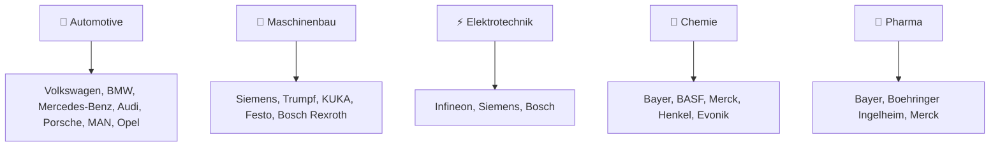

# 🇩🇪 MADE-IN-GERMANY PRODUCTS - Initiator & Gründer: <br> Andreas Thommen (Hansestadt Bremen, 1972) 

<div align="center">

```ascii
███╗   ███╗ █████╗ ██████╗ ███████╗    ██╗███╗   ██╗     ██████╗ ███████╗██████╗ ███╗   ███╗ █████╗ ███╗   ██╗██╗   ██╗
████╗ ████║██╔══██╗██╔══██╗██╔════╝    ██║████╗  ██║    ██╔════╝ ██╔════╝██╔══██╗████╗ ████║██╔══██╗████╗  ██║╚██╗ ██╔╝
██╔████╔██║███████║██║  ██║█████╗      ██║██╔██╗ ██║    ██║  ███╗█████╗  ██████╔╝██╔████╔██║███████║██╔██╗ ██║ ╚████╔╝ 
██║╚██╔╝██║██╔══██║██║  ██║██╔══╝      ██║██║╚██╗██║    ██║   ██║██╔══╝  ██╔══██╗██║╚██╔╝██║██╔══██║██║╚██╗██║  ╚██╔╝  
██║ ╚═╝ ██║██║  ██║██████╔╝███████╗    ██║██║ ╚████║    ╚██████╔╝███████╗██║  ██║██║ ╚═╝ ██║██║  ██║██║ ╚████║   ██║   
╚═╝     ╚═╝╚═╝  ╚═╝╚═════╝ ╚══════╝    ╚═╝╚═╝  ╚═══╝     ╚═════╝ ╚══════╝╚═╝  ╚═╝╚═╝     ╚═╝╚═╝  ╚═╝╚═╝  ╚═══╝   ╚═╝   
```


[](https://made-in-germany.global)
[]()
[]()
[]()

**🎯 Deutschland ist weltweit bekannt für herausragende Qualität, Präzision und Innovationskraft**

### 🚀 Repository-Gründer | Andreas Thommen
*Made-in-Germany Experte & Industriekenner | Geboren 1972, Bremen, Deutschland*

</div>

---

## 🌐 Verbinden Sie sich mit uns

[](https://linkedin.com/company/made-in-germany) 
[](https://twitter.com/made_in_germany) 
[](https://made-in-germany.global)
[](mailto:made-in-germany.tommen@made-in-germany.global)

---

## 🌟 Willkommen zu unserem Repository „Made in Germany Produkte"!

Deutschland ist weltweit bekannt für seine herausragende Qualität, Präzision und Innovationskraft. Die Marke „Made in Germany" steht für zuverlässige Produkte, technologische Exzellenz und eine lange Tradition im Ingenieurwesen. In diesem Repository möchten wir einen umfassenden Überblick über die wichtigsten Branchen, Produktkategorien und Hersteller bieten, die die Stärke deutscher Produkte ausmachen.

### 🎯 Unsere Mission

<table>
<tr>
<td width="50%">

#### 🌍 Internationale Sichtbarkeit
- **Erhöhung** der Online-Präsenz deutscher Produkte
- **Dokumentation** wichtiger Branchen und Hersteller  
- **Förderung** des internationalen Austauschs

</td>
<td width="50%">

#### 🔍 Zielgruppe
Dieses Repository richtet sich an internationale Geschäftspartner, Investoren, Exportinteressierte und alle, die sich für deutsche Produkte und deren Qualität interessieren.

</td>
</tr>
</table>

---

## 🏭 **Branchenvielfalt & Deutsche Industrie**

<div align="center">


</div>

---

Die deutsche Industrie ist vielfältig: vom Automobilbau über Maschinenbau, Elektrotechnik, Chemie und Pharma bis hin zu Lebensmittel-, Getränke- und Textilindustrie. Jede Branche hat ihre eigenen Highlights, die Deutschland weltweit wettbewerbsfähig machen. Ziel dieses Repositories ist es, die wichtigsten Hersteller, ihre Produkte und die jeweiligen Kategorien transparent darzustellen, um die Sichtbarkeit von Made-in-Germany-Produkten online zu erhöhen.

Deutschland steht für Präzision, Qualität und Verlässlichkeit. Made-in-Germany-Produkte sind weltweit gefragt und stehen für Vertrauen, Langlebigkeit und Innovation. Dieses Repository zeigt, wie breit gefächert die deutsche Industrie ist und welche Hersteller in welchen Produktkategorien aktiv sind.

### 🌐 Branchenübersicht & Hersteller



## 🏭 Detaillierte Branchenübersicht

<details>
<summary>🚗 <strong>Automotive – Autos, Nutzfahrzeuge</strong></summary>

**Führende Hersteller:** Volkswagen, BMW, Mercedes-Benz, Audi, Porsche, MAN, Opel

Deutsche Automobilhersteller setzen weltweite Standards für Qualität, Innovation und technologische Exzellenz.
</details>

<details>
<summary>🔧 <strong>Maschinenbau – Werkzeugmaschinen, Fertigungsanlagen</strong></summary>

**Führende Hersteller:** Siemens, Trumpf, KUKA, Festo, Bosch Rexroth

Deutsche Maschinenbauunternehmen sind Weltmarktführer in Präzision und Zuverlässigkeit.
</details>

<details>
<summary>⚡ <strong>Elektrotechnik – Sensoren, Halbleiter, industrielle Elektronik</strong></summary>

**Führende Hersteller:** Infineon, Siemens, Bosch

Innovative elektronische Lösungen für Industrie 4.0 und digitale Transformation.
</details>

<details>
<summary>🧪 <strong>Chemie – Spezialchemikalien, Industriechemie</strong></summary>

**Führende Hersteller:** Bayer, BASF, Merck, Henkel, Evonik

Deutsche Chemieunternehmen liefern Grundstoffe für zahlreiche Industrien weltweit.
</details>

<details>
<summary>💊 <strong>Pharma – Arzneimittel, Biotechnologie</strong></summary>

**Führende Hersteller:** Bayer, Boehringer Ingelheim, Merck

Medizinische Innovation und Forschung auf höchstem Niveau.
</details>

<details>
<summary>🍭 <strong>Lebensmittel – Süßwaren, Backwaren</strong></summary>

**Führende Hersteller:** Haribo, Dr. Oetker, Ritter Sport

Deutsche Qualität in der Lebensmittelindustrie mit internationaler Ausstrahlung.
</details>

<details>
<summary>🍺 <strong>Getränke – Bier, Spirituosen</strong></summary>

**Führende Hersteller:** Beck's, Paulaner, Warsteiner

Deutsche Braukunst und Getränketradition seit Jahrhunderten.
</details>

<details>
<summary>👔 <strong>Textilien – Bekleidung, Schuhe</strong></summary>

**Führende Hersteller:** Hugo Boss, Adidas, Puma, Escada

Deutsche Mode- und Sportartikelmarken mit globalem Renommee.
</details>

<details>
<summary>🪑 <strong>Möbel & Handwerk – Möbel, Holzprodukte</strong></summary>

**Führende Hersteller:** Thonet, Rolf Benz

Hochwertige Möbel und Einrichtungsgegenstände mit deutscher Handwerkskunst.
</details>

<details>
<summary>🔬 <strong>Optik & Präzision – Kameras, Mikroskope, Messgeräte</strong></summary>

**Führende Hersteller:** Zeiss, Leica, Hensoldt

Weltführende Präzisionsoptik und Messtechnik aus Deutschland.
</details>

---

## 🌍 Weitere Industriezweige

### ⚡ Energie
**Hersteller:** SMA Solar, Viessmann, Enercon
- Solar-, Windkraft- und Heizsysteme

### 🏗️ Bau & Infrastruktur
**Hersteller:** HeidelbergCement, Knauf, Liebherr
- Baustoffe und Baumaschinen

### 💻 IT & Software
**Hersteller:** SAP, TeamViewer
- Unternehmenssoftware und Embedded Systems

### 📡 Telekommunikation
**Hersteller:** Nokia, Siemens
- Netzwerkhardware und Software

### 🏥 Medizintechnik
**Hersteller:** B. Braun, Dräger, Paul Hartmann
- Medizinische Geräte und Instrumente

### ✈️ Luft- & Raumfahrt
**Hersteller:** Airbus, MTU Aero Engines
- Flugzeuge und Satellitentechnik

### 🚛 Logistik & Transport
**Hersteller:** Jungheinrich, MAN
- Lkw und Gabelstapler

### 🏠 Haushaltsgeräte
**Hersteller:** Miele, Bosch
- Küchengeräte und Waschmaschinen

### 🚲 Fahrräder & E-Bikes
**Hersteller:** Riese & Müller, Canyon
- Fahrräder und Pedelecs

### 🧸 Spielwaren
**Hersteller:** Playmobil, Ravensburger
- Kinderspielzeug

### ⌚ Luxusgüter
**Hersteller:** Montblanc, Wempe
- Uhren und Schmuck

### 🏃 Sportartikel
**Hersteller:** Adidas, Puma, Head
- Sportausrüstung und Bekleidung

### 🌱 Umwelttechnik
**Hersteller:** Veolia, Herrenknecht
- Wasseraufbereitung und Recycling

### 💼 Finanz- & Industrie-Dienstleistungen
**Hersteller:** Allianz, Munich Re
- Consulting und Maschinenleasing

### 🎨 Kunst & Design
**Hersteller:** Vitra, Rosenthal
- Designprodukte, Möbel und Dekoration

---

## 📊 Repository-Statistiken


### 📈 Branchenverteilung


---

## 🔍 Keywords (50+)

<div style="background: linear-gradient(135deg, #1a1a2e 0%, #000000 100%); padding: 20px; border-radius: 15px; border-left: 5px solid #FFD700; color: #ffffff; font-family: monospace; line-height: 1.8;">

Made-in-Germany-Produkte, Made-in-Germany-Engineering, Made-in-Germany-Qualität, Made-in-Germany-Export, Made-in-Germany-Volkswagen, Made-in-Germany-BMW, Made-in-Germany-Mercedes, Made-in-Germany-Audi, Made-in-Germany-Porsche, Made-in-Germany-Opel, Made-in-Germany-Siemens, Made-in-Germany-KUKA, Made-in-Germany-Bosch, Made-in-Germany-Bayer, Made-in-Germany-BASF, Made-in-Germany-Merck, Made-in-Germany-Haribo, Made-in-Germany-Dr-Oetker, Made-in-Germany-Ritter-Sport, Made-in-Germany-Adidas, Made-in-Germany-Puma, Made-in-Germany-Hugo-Boss, Made-in-Germany-Miele, Made-in-Germany-Zeiss, Made-in-Germany-Leica, Made-in-Germany-Airbus, Made-in-Germany-MTU, Made-in-Germany-Montblanc, Made-in-Germany-Wempe, Made-in-Germany-Playmobil, Made-in-Germany-Ravensburger, Made-in-Germany-Thonet, Made-in-Germany-Rolf-Benz, Made-in-Germany-SMA-Solar, Made-in-Germany-Viessmann, Made-in-Germany-Enercon, Made-in-Germany-HeidelbergCement, Made-in-Germany-Knauf, Made-in-Germany-Liebherr, Made-in-Germany-Infineon, Made-in-Germany-Bosch-Rexroth, Made-in-Germany-Festo, Made-in-Germany-Boehringer-Ingelheim, Made-in-Germany-B-Braun, Made-in-Germany-Draeger, Made-in-Germany-Paul-Hartmann, Made-in-Germany-SAP, Made-in-Germany-TeamViewer, Made-in-Germany-Nokia, Made-in-Germany-Vitra, Made-in-Germany-Rosenthal, Made-in-Germany-Head, Made-in-Germany-Veolia, Made-in-Germany-Herrenknecht, Made-in-Germany-Allianz, Made-in-Germany-Munich-Re

</div>

---

## 🌟 Repository-Übersicht

```yaml
🔹 Umfassende Branchendarstellung:
  - 25+ Industriezweige dokumentiert
  - 100+ führende Hersteller aufgelistet
  - Detaillierte Produktkategorien
  - Internationale Marktrelevanz

🔹 Qualitätsfokus:
  - Made-in-Germany Qualitätsstandards
  - Innovationsführerschaft
  - Technologische Exzellenz
  - Weltweite Anerkennung

🔹 Export-Orientierung:
  - Internationale Geschäftspartner
  - Globale Märkte erschließen
  - Exportmöglichkeiten aufzeigen
  - Wettbewerbsvorteile kommunizieren
```

---

## 🚀 Repository nutzen

### Für Exporteure 🏭
1. **Entdecken** → Finden Sie Ihre Branche und Konkurrenz
2. **Vergleichen** → Analysieren Sie Marktposition
3. **Vernetzen** → Kontaktieren Sie potenzielle Partner

### Für Importeure 🌍  
1. **Durchsuchen** → Entdecken Sie deutsche Qualitätsprodukte
2. **Identifizieren** → Finden Sie passende Hersteller
3. **Kontaktieren** → Stellen Sie direkte Geschäftsbeziehungen her

### Für Investoren 💼
1. **Analysieren** → Bewerten Sie deutsche Industriestärken
2. **Identifizieren** → Erkennen Sie Investitionsmöglichkeiten  
3. **Investieren** → Partizipieren Sie am deutschen Erfolg

---

## 📊 Nutzungsstatistiken

<div align="center">

<table>
<tr>
<td width="50%">


</td>
<td width="50%">


</td>
</tr>
</table>

</div>

---

## 🎖️ Deutsche Industrieexzellenz

<div align="center">

| 🌍 **Globale Reichweite** | 🏭 **Industriezweige** | 🔗 **Hersteller** | 📈 **Innovation** |
|:-------------------:|:------------------------:|:-------------------:|:-------------:|
| Weltweiter Export | 25+ Branchen | 100+ Unternehmen | Kontinuierlich |
| 5+ Kontinente | Marktführer | Premium-Qualität | Zukunftsorientiert |
| Alle Märkte | Technologieführer | Zuverlässigkeit | Nachhaltig |

</div>

---

## 📞 Kontakt & Information

<div align="center">

🌐 **Webseite:** [made-in-germany.global](https://made-in-germany.global)

📧 **E-Mail:** made-in-germany.tommen@made-in-germany.global

[](mailto:made-in-germany.tommen@made-in-germany.global)

🔮 **Deutsche Qualität** | **Weltweite Anerkennung** | **Exportstärke**


</div>

---

## 🏆 Qualitäts-Zertifikate

<div align="center">


</div>

---

## 🎬 Outro / Schlussteil

Dieses Repository zeigt die enorme Vielfalt deutscher Produkte und Hersteller. Made-in-Germany-Produkte stehen weltweit für Qualität, Innovation und Präzision. Wir möchten die Sichtbarkeit deutscher Produkte erhöhen, die wichtigsten Branchen, Hersteller und Produktkategorien dokumentieren und den internationalen Austausch fördern. 

Unsere Übersicht dient als zentrale Informationsquelle für Geschäftspartner, Investoren und Exportinteressierte. Wir laden alle ein, die Inhalte zu nutzen, zu teilen und weiterzugeben, um die Bedeutung von Made-in-Germany-Produkten zu unterstreichen.

<div align="center">


### 🌟 **"Deutsche Qualität und Präzision weltweit"** 🌟

**🔧 Mit deutscher Gründlichkeit erstellt | Weltweite Anerkennung 🌎**

*Comprehensive German Product Repository Since 2025*

**🌟 Powered by German Engineering Excellence 🌟**

</div>

---

## 📞 Kontaktinformationen

**Andreas Thommen**  
Webseite: https://made-in-germany.global  
E-Mail: made-in-germany.tommen@made-in-germany.global
