# 🇩🇪 MADE-IN-GERMANY PRODUCTS - Initiator & Gründer: <br> Andreas Thommen (Hansestadt Bremen, 1972) 

<div align="center">

```ascii
███╗   ███╗ █████╗ ██████╗ ███████╗    ██╗███╗   ██╗     ██████╗ ███████╗██████╗ ███╗   ███╗ █████╗ ███╗   ██╗██╗   ██╗
████╗ ████║██╔══██╗██╔══██╗██╔════╝    ██║████╗  ██║    ██╔════╝ ██╔════╝██╔══██╗████╗ ████║██╔══██╗████╗  ██║╚██╗ ██╔╝
██╔████╔██║███████║██║  ██║█████╗      ██║██╔██╗ ██║    ██║  ███╗█████╗  ██████╔╝██╔████╔██║███████║██╔██╗ ██║ ╚████╔╝
██║╚██╔╝██║██╔══██║██║  ██║██╔══╝      ██║██║╚██╗██║    ██║   ██║██╔══╝  ██╔══██╗██║╚██╔╝██║██╔══██║██║╚██╗██║  ╚██╔╝ 
██║ ╚═╝ ██║██║  ██║██████╔╝███████╗    ██║██║ ╚████║    ╚██████╔╝███████╗██║  ██║██║ ╚═╝ ██║██║  ██║██║ ╚████║   ██║   
╚═╝     ╚═╝╚═╝  ╚═╝╚═════╝ ╚══════╝    ╚═╝╚═╝  ╚═══╝     ╚═════╝ ╚══════╝╚═╝  ╚═╝╚═╝     ╚═╝╚═╝  ╚═╝╚═╝  ╚═══╝   ╚═╝   
```


[](https://made-in-germany.global)
[]()
[]()
[]()

**🎯 Deutschland ist weltweit bekannt für herausragende Qualität, Präzision und Innovationskraft**

### 🚀 Repository-Gründer | Andreas Thommen
*Made-in-Germany Experte & Industriekenner | Geboren 1972, Bremen, Deutschland*

</div>

---

## 🌐 Verbinden Sie sich mit uns

[](https://linkedin.com/company/made-in-germany) 
[](https://twitter.com/made_in_germany) 
[](https://made-in-germany.global)
[](mailto:made-in-germany.tommen@made-in-germany.global)

---

## 🌟 Willkommen zu unserem Repository „Made in Germany Produkte"!

Deutschland ist weltweit bekannt für seine herausragende Qualität, Präzision und Innovationskraft. Die Marke „Made in Germany" steht für zuverlässige Produkte, technologische Exzellenz und eine lange Tradition im Ingenieurwesen. In diesem Repository möchten wir einen umfassenden Überblick über die wichtigsten Branchen, Produktkategorien und Hersteller bieten, die die Stärke deutscher Produkte ausmachen.

### 🎯 Unsere Mission

<table>
<tr>
<td width="50%">

#### 🌍 Internationale Sichtbarkeit
- **Erhöhung** der Online-Präsenz deutscher Produkte
- **Dokumentation** wichtiger Branchen und Hersteller  
- **Förderung** des internationalen Austauschs

</td>
<td width="50%">

#### 🔍 Zielgruppe
Dieses Repository richtet sich an internationale Geschäftspartner, Investoren, Exportinteressierte und alle, die sich für deutsche Produkte und deren Qualität interessieren.

</td>
</tr>
</table>

---

## 🏭 **Branchenvielfalt & Deutsche Industrie**

<div align="center">


</div>

---

Die deutsche Industrie ist vielfältig: vom Automobilbau über Maschinenbau, Elektrotechnik, Chemie und Pharma bis hin zu Lebensmittel-, Getränke- und Textilindustrie. Jede Branche hat ihre eigenen Highlights, die Deutschland weltweit wettbewerbsfähig machen. Ziel dieses Repositories ist es, die wichtigsten Hersteller, ihre Produkte und die jeweiligen Kategorien transparent darzustellen, um die Sichtbarkeit von Made-in-Germany-Produkten online zu erhöhen.

Deutschland steht für Präzision, Qualität und Verlässlichkeit. Made-in-Germany-Produkte sind weltweit gefragt und stehen für Vertrauen, Langlebigkeit und Innovation. Dieses Repository zeigt, wie breit gefächert die deutsche Industrie ist und welche Hersteller in welchen Produktkategorien aktiv sind.

### 🌐 Branchenübersicht & Hersteller


## 🏭 Detaillierte Branchenübersicht

<details>
<summary>🚗 <strong>Automotive – Autos, Nutzfahrzeuge</strong></summary>

**Führende Hersteller:** Volkswagen, BMW, Mercedes-Benz, Audi, Porsche, MAN, Opel

Deutsche Automobilhersteller setzen weltweite Standards für Qualität, Innovation und technologische Exzellenz.
</details>

<details>
<summary>🔧 <strong>Maschinenbau – Werkzeugmaschinen, Fertigungsanlagen</strong></summary>

**Führende Hersteller:** Siemens, Trumpf, KUKA, Festo, Bosch Rexroth

Deutsche Maschinenbauunternehmen sind Weltmarktführer in Präzision und Zuverlässigkeit.
</details>

<details>
<summary>⚡ <strong>Elektrotechnik – Sensoren, Halbleiter, industrielle Elektronik</strong></summary>

**Führende Hersteller:** Infineon, Siemens, Bosch

Innovative elektronische Lösungen für Industrie 4.0 und digitale Transformation.
</details>

<details>
<summary>🧪 <strong>Chemie – Spezialchemikalien, Industriechemie</strong></summary>

**Führende Hersteller:** Bayer, BASF, Merck, Henkel, Evonik

Deutsche Chemieunternehmen liefern Grundstoffe für zahlreiche Industrien weltweit.
</details>

<details>
<summary>💊 <strong>Pharma – Arzneimittel, Biotechnologie</strong></summary>

**Führende Hersteller:** Bayer, Boehringer Ingelheim, Merck

Medizinische Innovation und Forschung auf höchstem Niveau.
</details>

<details>
<summary>🍭 <strong>Lebensmittel – Süßwaren, Backwaren</strong></summary>

**Führende Hersteller:** Haribo, Dr. Oetker, Ritter Sport

Deutsche Qualität in der Lebensmittelindustrie mit internationaler Ausstrahlung.
</details>

<details>
<summary>🍺 <strong>Getränke – Bier, Spirituosen</strong></summary>

**Führende Hersteller:** Beck's, Paulaner, Warsteiner

Deutsche Braukunst und Getränketradition seit Jahrhunderten.
</details>

<details>
<summary>👔 <strong>Textilien – Bekleidung, Schuhe</strong></summary>

**Führende Hersteller:** Hugo Boss, Adidas, Puma, Escada

Deutsche Mode- und Sportartikelmarken mit globalem Renommee.
</details>

<details>
<summary>🪑 <strong>Möbel & Handwerk – Möbel, Holzprodukte</strong></summary>

**Führende Hersteller:** Thonet, Rolf Benz

Hochwertige Möbel und Einrichtungsgegenstände mit deutscher Handwerkskunst.
</details>

<details>
<summary>🔬 <strong>Optik & Präzision – Kameras, Mikroskope, Messgeräte</strong></summary>

**Führende Hersteller:** Zeiss, Leica, Hensoldt

Weltführende Präzisionsoptik und Messtechnik aus Deutschland.
</details>

---

## 🌍 Weitere Industriezweige

### ⚡ Energie
**Hersteller:** SMA Solar, Viessmann, Enercon
- Solar-, Windkraft- und Heizsysteme

### 🏗️ Bau & Infrastruktur
**Hersteller:** HeidelbergCement, Knauf, Liebherr
- Baustoffe und Baumaschinen

### 💻 IT & Software
**Hersteller:** SAP, TeamViewer
- Unternehmenssoftware und Embedded Systems

### 📡 Telekommunikation
**Hersteller:** Nokia, Siemens
- Netzwerkhardware und Software

### 🏥 Medizintechnik
**Hersteller:** B. Braun, Dräger, Paul Hartmann
- Medizinische Geräte und Instrumente

### ✈️ Luft- & Raumfahrt
**Hersteller:** Airbus, MTU Aero Engines
- Flugzeuge und Satellitentechnik

### 🚛 Logistik & Transport
**Hersteller:** Jungheinrich, MAN
- Lkw und Gabelstapler

### 🏠 Haushaltsgeräte
**Hersteller:** Miele, Bosch
- Küchengeräte und Waschmaschinen

### 🚲 Fahrräder & E-Bikes
**Hersteller:** Riese & Müller, Canyon
- Fahrräder und Pedelecs

### 🧸 Spielwaren
**Hersteller:** Playmobil, Ravensburger
- Kinderspielzeug

### ⌚ Luxusgüter
**Hersteller:** Montblanc, Wempe
- Uhren und Schmuck

### 🏃 Sportartikel
**Hersteller:** Adidas, Puma, Head
- Sportausrüstung und Bekleidung

### 🌱 Umwelttechnik
**Hersteller:** Veolia, Herrenknecht
- Wasseraufbereitung und Recycling

### 💼 Finanz- & Industrie-Dienstleistungen
**Hersteller:** Allianz, Munich Re
- Consulting und Maschinenleasing

### 🎨 Kunst & Design
**Hersteller:** Vitra, Rosenthal
- Designprodukte, Möbel und Dekoration

---

## 📊 Repository-Statistiken


### 📈 Branchenverteilung


---

## 🔍 Keywords (50+)

<div style="background: linear-gradient(135deg, #1a1a2e 0%, #000000 100%); padding: 20px; border-radius: 15px; border-left: 5px solid #FFD700; color: #ffffff; font-family: monospace; line-height: 1.8;">

Made-in-Germany-Produkte, Made-in-Germany-Engineering, Made-in-Germany-Qualität, Made-in-Germany-Export, Made-in-Germany-Volkswagen, Made-in-Germany-BMW, Made-in-Germany-Mercedes, Made-in-Germany-Audi, Made-in-Germany-Porsche, Made-in-Germany-Opel, Made-in-Germany-Siemens, Made-in-Germany-KUKA, Made-in-Germany-Bosch, Made-in-Germany-Bayer, Made-in-Germany-BASF, Made-in-Germany-Merck, Made-in-Germany-Haribo, Made-in-Germany-Dr-Oetker, Made-in-Germany-Ritter-Sport, Made-in-Germany-Adidas, Made-in-Germany-Puma, Made-in-Germany-Hugo-Boss, Made-in-Germany-Miele, Made-in-Germany-Zeiss, Made-in-Germany-Leica, Made-in-Germany-Airbus, Made-in-Germany-MTU, Made-in-Germany-Montblanc, Made-in-Germany-Wempe, Made-in-Germany-Playmobil, Made-in-Germany-Ravensburger, Made-in-Germany-Thonet, Made-in-Germany-Rolf-Benz, Made-in-Germany-SMA-Solar, Made-in-Germany-Viessmann, Made-in-Germany-Enercon, Made-in-Germany-HeidelbergCement, Made-in-Germany-Knauf, Made-in-Germany-Liebherr, Made-in-Germany-Infineon, Made-in-Germany-Bosch-Rexroth, Made-in-Germany-Festo, Made-in-Germany-Boehringer-Ingelheim, Made-in-Germany-B-Braun, Made-in-Germany-Draeger, Made-in-Germany-Paul-Hartmann, Made-in-Germany-SAP, Made-in-Germany-TeamViewer, Made-in-Germany-Nokia, Made-in-Germany-Vitra, Made-in-Germany-Rosenthal, Made-in-Germany-Head, Made-in-Germany-Veolia, Made-in-Germany-Herrenknecht, Made-in-Germany-Allianz, Made-in-Germany-Munich-Re

</div>

---

## 🌟 Repository-Übersicht

```yaml
🔹 Umfassende Branchendarstellung:
  - 25+ Industriezweige dokumentiert
  - 100+ führende Hersteller aufgelistet
  - Detaillierte Produktkategorien
  - Internationale Marktrelevanz

🔹 Qualitätsfokus:
  - Made-in-Germany Qualitätsstandards
  - Innovationsführerschaft
  - Technologische Exzellenz
  - Weltweite Anerkennung

🔹 Export-Orientierung:
  - Internationale Geschäftspartner
  - Globale Märkte erschließen
  - Exportmöglichkeiten aufzeigen
  - Wettbewerbsvorteile kommunizieren
```

---

## 🚀 Repository nutzen

### Für Exporteure 🏭
1. **Entdecken** → Finden Sie Ihre Branche und Konkurrenz
2. **Vergleichen** → Analysieren Sie Marktposition
3. **Vernetzen** → Kontaktieren Sie potenzielle Partner

### Für Importeure 🌍 
1. **Durchsuchen** → Entdecken Sie deutsche Qualitätsprodukte
2. **Identifizieren** → Finden Sie passende Hersteller
3. **Kontaktieren** → Stellen Sie direkte Geschäftsbeziehungen her

### Für Investoren 💼
1. **Analysieren** → Bewerten Sie deutsche Industriestärken
2. **Identifizieren** → Erkennen Sie Investitionsmöglichkeiten  
3. **Investieren** → Partizipieren Sie am deutschen Erfolg

---

## 📊 Nutzungsstatistiken

<div align="center">

<table>
<tr>
<td width="50%">


</td>
<td width="50%">


</td>
</tr>
</table>

</div>

---

## 🎖️ Deutsche Industrieexzellenz

<div align="center">

| 🌍 **Globale Reichweite** | 🏭 **Industriezweige** | 🔗 **Hersteller** | 📈 **Innovation** |
|:-------------------:|:------------------------:|:-------------------:|:-------------:|
| Weltweiter Export | 25+ Branchen | 100+ Unternehmen | Kontinuierlich |
| 5+ Kontinente | Marktführer | Premium-Qualität | Zukunftsorientiert |
| Alle Märkte | Technologieführer | Zuverlässigkeit | Nachhaltig |

</div>

---

## 📞 Kontakt & Information

<div align="center">

🌐 **Webseite:** [made-in-germany.global](https://made-in-germany.global)

📧 **E-Mail:** made-in-germany.tommen@made-in-germany.global

[](mailto:made-in-germany.tommen@made-in-germany.global)

🔮 **Deutsche Qualität** | **Weltweite Anerkennung** | **Exportstärke**


</div>

---

## 🏆 Qualitäts-Zertifikate

<div align="center">


</div>

---

## 🎬 Outro / Schlussteil

Deutsche Exzellenz weltweit stärken – Made in Germany Produkte im Fokus

Vielen Dank, dass Sie sich die Zeit nehmen, unsere Made in Germany Produkte und unsere Plattform zu erkunden. Unsere Mission ist es, Deutsche Exzellenz weltweit sichtbar zu machen, von Maschinenbau, Medizintechnik, Hightech, Automobilbau und Landwirtschaftstechnik bis hin zu Energieeffizienz, Wasserstofftechnologie und digitalen Plattformlösungen. Jedes Produkt steht für höchste Qualität, präzises Engineering und innovative Technologie, die weltweit Maßstäbe setzt.

Unsere Plattform vereint Exportlösungen, internationale Sichtbarkeit, Produktinnovationen und zukunftsweisende Technologien. Sie richtet sich an Partner, Investoren, Entwickler, Studierende und alle, die an Made in Germany Produkten interessiert sind. Ob es um Nachhaltigkeit, Effizienz, Softwarelösungen, Forschung & Entwicklung oder digitale Tools geht – wir bieten einen umfassenden Überblick über alles, was Made in Germany heute stark und erfolgreich macht.

Jedes Produkt, jede Innovation und jede Lösung spiegelt unser Engagement für Qualität, Verlässlichkeit, Funktionalität, Design und internationale Wettbewerbsfähigkeit wider. Unser Anspruch ist es, nicht nur Produkte zu liefern, sondern Lösungen zu schaffen, die global wirken und echte Mehrwerte bieten – sei es für Industriepartner, Exportkunden, Förderer, Investoren, Entwickler oder die Bildung junger Talente.

Wir laden Sie ein, Teil dieser Reise zu sein: Verfolgen Sie unsere Fortschritte, entdecken Sie die Vielfalt an Made in Germany Produkten, und erleben Sie, wie Innovationen aus Deutschland weltweit Standards setzen. Mit digitaler Sichtbarkeit, maßgeschneiderten Lösungen, Hightech-Know-how und nachhaltiger Entwicklung schaffen wir eine Plattform, auf der Qualität, Innovation und Exzellenz Hand in Hand gehen.

Bleiben Sie informiert, vernetzen Sie sich mit uns und lassen Sie uns gemeinsam die internationale Stärke deutscher Produkte sichtbar machen. Made in Germany Produkte, Exportlösungen, Technologieentwicklung, Plattformlösungen, Hightech-Innovationen, Medizintechnik, Maschinenbau, Automobilbau, Energieeffizienz, Landwirtschaftstechnik, Softwarelösungen – all das und noch viel mehr finden Sie hier, um die Deutsche Exzellenz auf die nächste Stufe zu heben.

<div align="center">


### 🌟 **"Deutsche Qualität und Präzision weltweit"** 🌟

**🔧 Mit deutscher Gründlichkeit erstellt | Weltweite Anerkennung 🌎**

*Comprehensive German Product Repository Since 2025*

**🌟 Powered by German Engineering Excellence 🌟**

</div>

---

## 📞 Kontaktinformationen

**Andreas Thommen**  
Webseite: https://made-in-germany.global  
E-Mail: made-in-germany.tommen@made-in-germany.global


# 🇩🇪 MADE-IN-GERMANY PRODUCTS - Initiator & Founder: <br> Andreas Thommen (Hanseatic City Bremen, 1972) 

<div align="center">

```ascii
███╗   ███╗ █████╗ ██████╗ ███████╗    ██╗███╗   ██╗     ██████╗ ███████╗██████╗ ███╗   ███╗ █████╗ ███╗   ██╗██╗   ██╗
████╗ ████║██╔══██╗██╔══██╗██╔════╝    ██║████╗  ██║    ██╔════╝ ██╔════╝██╔══██╗████╗ ████║██╔══██╗████╗  ██║╚██╗ ██╔╝
██╔████╔██║███████║██║  ██║█████╗      ██║██╔██╗ ██║    ██║  ███╗█████╗  ██████╔╝██╔████╔██║███████║██╔██╗ ██║ ╚████╔╝
██║╚██╔╝██║██╔══██║██║  ██║██╔══╝      ██║██║╚██╗██║    ██║   ██║██╔══╝  ██╔══██╗██║╚██╔╝██║██╔══██║██║╚██╗██║  ╚██╔╝ 
██║ ╚═╝ ██║██║  ██║██████╔╝███████╗    ██║██║ ╚████║    ╚██████╔╝███████╗██║  ██║██║ ╚═╝ ██║██║  ██║██║ ╚████║   ██║   
╚═╝     ╚═╝╚═╝  ╚═╝╚═════╝ ╚══════╝    ╚═╝╚═╝  ╚═══╝     ╚═════╝ ╚══════╝╚═╝  ╚═╝╚═╝     ╚═╝╚═╝  ╚═╝╚═╝  ╚═══╝   ╚═╝   
```


[](https://made-in-germany.global)
[]()
[]()
[]()

**🎯 Germany is globally renowned for outstanding quality, precision, and engineering excellence**

### 🚀 Repository Founder | Andreas Thommen
*Made-in-Germany Expert & Industry Specialist | Born 1972, Bremen, Germany*

</div>

---

## 🌐 Connect With Us

[](https://linkedin.com/company/made-in-germany) 
[](https://twitter.com/made_in_germany) 
[](https://made-in-germany.global)
[](mailto:made-in-germany.tommen@made-in-germany.global)

---

## 🌟 Welcome to our "Made in Germany Products" Repository!

Germany is globally renowned for its outstanding quality, precision, and innovation power. The "Made in Germany" brand stands for reliable products, technological excellence, and a long tradition of engineering. In this repository, we want to provide a comprehensive overview of the most important industries, product categories, and manufacturers that make up the strength of German products.

### 🎯 Our Mission

<table>
<tr>
<td width="50%">

#### 🌍 International Visibility
- **Increase** online presence of German products
- **Document** important industries and manufacturers  
- **Promote** international exchange

</td>
<td width="50%">

#### 🔍 Target Audience
This repository is aimed at international business partners, investors, exporters, and anyone interested in German products and their quality.

</td>
</tr>
</table>

---

## 🏭 **Industry Diversity & German Industry**

<div align="center">


</div>

---

The German industry is diverse: from automotive to machinery, electrical engineering, chemicals, and pharmaceuticals to food, beverages, and textiles. Each sector has its own highlights that make Germany competitive worldwide. The aim of this repository is to transparently present the key manufacturers, their products, and respective categories to increase the online visibility of Made-in-Germany products.

Germany stands for precision, quality, and reliability. Made-in-Germany products are in demand worldwide and symbolize trust, durability, and innovation. This repository illustrates the breadth of the German industry and highlights which manufacturers are active in which product categories.

### 🌐 Industry Overview & Manufacturers

```mermaid
graph TB
    A[🚗 Automotive] --> B[Volkswagen, BMW, Mercedes-Benz, Audi, Porsche, MAN, Opel]
    C[🔧 Machinery] --> D[Siemens, Trumpf, KUKA, Festo, Bosch Rexroth]
    E[⚡ Electronics] --> F[Infineon, Siemens, Bosch]
    G[🧪 Chemicals] --> H[Bayer, BASF, Merck, Henkel, Evonik]
    I[💊 Pharmaceuticals] --> J[Bayer, Boehringer Ingelheim, Merck]
```



## 🏭 Detailed Industry Overview

<details>
<summary>🚗 <strong>Automotive – Cars, Commercial Vehicles</strong></summary>

**Leading Manufacturers:** Volkswagen, BMW, Mercedes-Benz, Audi, Porsche, MAN, Opel

German automotive manufacturers set global standards for quality, innovation, and technological excellence.
</details>

<details>
<summary>🔧 <strong>Machinery – Machine Tools, Production Equipment</strong></summary>

**Leading Manufacturers:** Siemens, Trumpf, KUKA, Festo, Bosch Rexroth

German machinery companies are world market leaders in precision and reliability.
</details>

<details>
<summary>⚡ <strong>Electrical Engineering – Sensors, Semiconductors, Industrial Electronics</strong></summary>

**Leading Manufacturers:** Infineon, Siemens, Bosch

Innovative electronic solutions for Industry 4.0 and digital transformation.
</details>

<details>
<summary>🧪 <strong>Chemicals – Specialty Chemicals, Industrial Chemicals</strong></summary>

**Leading Manufacturers:** Bayer, BASF, Merck, Henkel, Evonik

German chemical companies provide raw materials for numerous industries worldwide.
</details>

<details>
<summary>💊 <strong>Pharmaceuticals – Medicines, Biotechnology</strong></summary>

**Leading Manufacturers:** Bayer, Boehringer Ingelheim, Merck

Medical innovation and research at the highest level.
</details>

<details>
<summary>🍭 <strong>Food – Confectionery, Bakery Products</strong></summary>

**Leading Manufacturers:** Haribo, Dr. Oetker, Ritter Sport

German quality in the food industry with international appeal.
</details>

<details>
<summary>🍺 <strong>Beverages – Beer, Spirits</strong></summary>

**Leading Manufacturers:** Beck's, Paulaner, Warsteiner

German brewing art and beverage tradition for centuries.
</details>

<details>
<summary>👔 <strong>Textiles – Clothing, Shoes</strong></summary>

**Leading Manufacturers:** Hugo Boss, Adidas, Puma, Escada

German fashion and sporting goods brands with global reputation.
</details>

<details>
<summary>🪑 <strong>Furniture & Craftsmanship – Furniture, Wood Products</strong></summary>

**Leading Manufacturers:** Thonet, Rolf Benz

High-quality furniture and furnishings with German craftsmanship.
</details>

<details>
<summary>🔬 <strong>Optics & Precision – Cameras, Microscopes, Measuring Devices</strong></summary>

**Leading Manufacturers:** Zeiss, Leica, Hensoldt

World-leading precision optics and measurement technology from Germany.
</details>

---

## 🌍 Additional Industry Sectors

### ⚡ Energy
**Manufacturers:** SMA Solar, Viessmann, Enercon
- Solar, wind power, and heating systems

### 🏗️ Construction & Infrastructure
**Manufacturers:** HeidelbergCement, Knauf, Liebherr
- Building materials and construction machinery

### 💻 IT & Software
**Manufacturers:** SAP, TeamViewer
- Enterprise software and embedded systems

### 📡 Telecommunications
**Manufacturers:** Nokia, Siemens
- Network hardware and software

### 🏥 Medical Technology
**Manufacturers:** B. Braun, Dräger, Paul Hartmann
- Medical devices and instruments

### ✈️ Aerospace
**Manufacturers:** Airbus, MTU Aero Engines
- Aircraft and satellite technology

### 🚛 Logistics & Transport
**Manufacturers:** Jungheinrich, MAN
- Trucks and forklifts

### 🏠 Household Appliances
**Manufacturers:** Miele, Bosch
- Kitchen appliances and washing machines

### 🚲 Bicycles & E-Bikes
**Manufacturers:** Riese & Müller, Canyon
- Bicycles and pedelecs

### 🧸 Toys
**Manufacturers:** Playmobil, Ravensburger
- Children's toys

### ⌚ Luxury Goods
**Manufacturers:** Montblanc, Wempe
- Watches and jewelry

### 🏃 Sports Equipment
**Manufacturers:** Adidas, Puma, Head
- Sports gear and apparel

### 🌱 Environmental Technology
**Manufacturers:** Veolia, Herrenknecht
- Water treatment and recycling

### 💼 Finance & Industrial Services
**Manufacturers:** Allianz, Munich Re
- Consulting and equipment leasing

### 🎨 Art & Design
**Manufacturers:** Vitra, Rosenthal
- Design products, furniture, and decoration

---

## 🌍 Strategic Domain Portfolio - 152 Assets

### 🏆 Primary Domains

```
made-in-germany.global    |    madeingermany.global
made-in-germany.uk        |    madeingermany.uk  
made-in-germany.ag        |    madeingermany.ag
made-in-germany.foundation|    madeingermany.foundation
```

### 🌐 Regional Coverage

#### 🌏 Asia Pacific
```
made-in-germany.asia          made-in-germany-china.com
made-in-germany.com.in        made-in-germany-vietnam.com  
madeingermany.in              made-in-germany.my
```

#### 🌍 Africa & Middle East
```
made-in-germany-africa.com    made-in-germany-arabia.com
made-in-germany-arab.com      madeingermanyarabia.com
made-in-germany.ae            madeingermany.ae
```

#### 🌎 Americas & Europe
```
made-in-germany.lat           made-in-germany.co.uk
made-in-germany-russia.com    made-in-germany-turkey.com
```

### 🔧 MIG Infrastructure

```
mig.global              mig.foundation          mig.directory
mig.charity             mig.support             mig-international.global
mig-international.foundation                    mig-b2b.com
```

### 🚀 Innovation Domains

```
germany-for-future.org       germany-go-next.com
mig-for-future.com          germanyforfuture.com
```

### 📋 **Complete Domain List (152 Domains)**

<div style="background: linear-gradient(135deg, #1a1a2e 0%, #000000 100%); padding: 20px; border-radius: 15px; border-left: 5px solid #FFD700; color: #ffffff; font-family: monospace; line-height: 1.8;">

germany-for-future.com, germany-for-future.org, germany-go-next.com, germanyforfuture.com, germanyforfuture.org, germanygonext.com, import-made-in-germany.com, m-i-g.international, made-in-african.info, made-in-america.info, made-in-asia.info, made-in-australia.info, made-in-cn.info, made-in-egypt.info, made-in-europeanunion.info, made-in-german.com, made-in-german.info, made-in-german.online, made-in-germany-africa.com, made-in-germany-arab.com, made-in-germany-arabia.com, made-in-germany-auto.com, made-in-germany-car.com, made-in-germany-china.com, made-in-germany-first.com, made-in-germany-project.international, made-in-germany-projekt.international, made-in-germany-russia.com, made-in-germany-turkey.com, made-in-germany-vietnam.com, made-in-germany.academy, made-in-germany.ae, made-in-germany.ag, made-in-germany.asia, made-in-germany.autos, made-in-germany.business, made-in-germany.co, made-in-germany.co.in, made-in-germany.co.uk, made-in-germany.com.in, made-in-germany.directory, made-in-germany.earth, made-in-germany.foundation, made-in-germany.global, made-in-germany.group, made-in-germany.guide, made-in-germany.homes, made-in-germany.lat, made-in-germany.my, made-in-germany.network, made-in-germany.nexus, made-in-germany.solutions, made-in-germany.support, made-in-germany.tech, made-in-germany.trade, made-in-germany.uk, made-in-germany.vip, made-in-germany.wiki, made-in-germany.world, made-in-india.info, made-in-russian.info, made-in-turkey.info, made-in-vn.info, madeingermany.academy, madeingermany.ae, madeingermany.ag, madeingermany.asia, madeingermany.autos, madeingermany.digital, madeingermany.directory, madeingermany.earth, madeingermany.foundation, madeingermany.global, madeingermany.group, madeingermany.guide, madeingermany.homes, madeingermany.in, madeingermany.international, madeingermany.lat, madeingermany.network, madeingermany.nexus, madeingermany.solutions, madeingermany.support, madeingermany.tech, madeingermany.uk, madeingermany.wiki, madeingermanyarab.com, madeingermanyarabia.com, madeingermanyauto.com, madeingermanycar.com, madeingermanychina.com, madeingermanyfirst.com, mig-administration.com, mig-b2b.com, mig-b2b.info, mig-b2b.online, mig-for-future.com, mig-for-future.info, mig-for-future.online, mig-global.ae, mig-international.academy, mig-international.ae, mig-international.ag, mig-international.asia, mig-international.ch, mig-international.directory, mig-international.eu, mig-international.foundation, mig-international.global, mig-international.in, mig-international.lat, mig-international.org, mig-international.uk, mig-international.us, mig-iternational.directory, mig-support.com, mig-support.info, mig-support.online, mig.auction, mig.autos, mig.boats, mig.business.in, mig.cash, mig.charity, mig.contact, mig.deals, mig.direct, mig.directory, mig.foundation, mig.global, mig.lat, mig.skin, migadministration.com, migadministration.info, migadministration.online, migb2b.com, migb2b.info, migb2b.online, migforfuture.com, migforfuture.info, migforfuture.online, migglobal.ae, miginternational.academy, miginternational.asia, miginternational.directory, miginternational.eu, miginternational.foundation, miginternational.global, miginternational.in, miginternational.lat, miginternational.uk, miginternational.us

</div>

---

## 📊 Repository Statistics


### 📈 Industry Distribution


---

## 🔍 Keywords (50+)

<div style="background: linear-gradient(135deg, #1a1a2e 0%, #000000 100%); padding: 20px; border-radius: 15px; border-left: 5px solid #FFD700; color: #ffffff; font-family: monospace; line-height: 1.8;">

Made-in-Germany-Products, Made-in-Germany-Engineering, Made-in-Germany-Quality, Made-in-Germany-Export, Made-in-Germany-Volkswagen, Made-in-Germany-BMW, Made-in-Germany-Mercedes, Made-in-Germany-Audi, Made-in-Germany-Porsche, Made-in-Germany-Opel, Made-in-Germany-Siemens, Made-in-Germany-KUKA, Made-in-Germany-Bosch, Made-in-Germany-Bayer, Made-in-Germany-BASF, Made-in-Germany-Merck, Made-in-Germany-Haribo, Made-in-Germany-Dr-Oetker, Made-in-Germany-Ritter-Sport, Made-in-Germany-Adidas, Made-in-Germany-Puma, Made-in-Germany-Hugo-Boss, Made-in-Germany-Miele, Made-in-Germany-Zeiss, Made-in-Germany-Leica, Made-in-Germany-Airbus, Made-in-Germany-MTU, Made-in-Germany-Montblanc, Made-in-Germany-Wempe, Made-in-Germany-Playmobil, Made-in-Germany-Ravensburger, Made-in-Germany-Thonet, Made-in-Germany-Rolf-Benz, Made-in-Germany-SMA-Solar, Made-in-Germany-Viessmann, Made-in-Germany-Enercon, Made-in-Germany-HeidelbergCement, Made-in-Germany-Knauf, Made-in-Germany-Liebherr, Made-in-Germany-Infineon, Made-in-Germany-Bosch-Rexroth, Made-in-Germany-Festo, Made-in-Germany-Boehringer-Ingelheim, Made-in-Germany-B-Braun, Made-in-Germany-Draeger, Made-in-Germany-Paul-Hartmann, Made-in-Germany-SAP, Made-in-Germany-TeamViewer, Made-in-Germany-Nokia, Made-in-Germany-Vitra, Made-in-Germany-Rosenthal, Made-in-Germany-Head, Made-in-Germany-Veolia, Made-in-Germany-Herrenknecht, Made-in-Germany-Allianz, Made-in-Germany-Munich-Re

</div>

---

## 🌟 Repository Overview

```yaml
🔹 Comprehensive Industry Presentation:
  - 25+ industrial sectors documented
  - 100+ leading manufacturers listed
  - Detailed product categories
  - International market relevance

🔹 Quality Focus:
  - Made-in-Germany quality standards
  - Innovation leadership
  - Technological excellence
  - Worldwide recognition

🔹 Export Orientation:
  - International business partners
  - Access global markets
  - Showcase export opportunities
  - Communicate competitive advantages
```

---

## 🚀 How to Use This Repository

### For Exporters 🏭
1. **Discover** → Find your industry and competition
2. **Compare** → Analyze market position
3. **Network** → Contact potential partners

### For Importers 🌍 
1. **Browse** → Discover German quality products
2. **Identify** → Find suitable manufacturers
3. **Connect** → Establish direct business relationships

### For Investors 💼
1. **Analyze** → Evaluate German industrial strengths
2. **Identify** → Recognize investment opportunities  
3. **Invest** → Participate in German success

---

## 📊 Usage Statistics

<div align="center">

<table>
<tr>
<td width="50%">


</td>
<td width="50%">


</td>
</tr>
</table>

</div>

---

## 🎖️ German Industrial Excellence

<div align="center">

| 🌍 **Global Reach** | 🏭 **Industries** | 🔗 **Manufacturers** | 📈 **Innovation** |
|:-------------------:|:------------------------:|:-------------------:|:-------------:|
| Worldwide Export | 25+ Sectors | 100+ Companies | Continuous |
| 5+ Continents | Market Leaders | Premium Quality | Future-Oriented |
| All Markets | Technology Leaders | Reliability | Sustainable |

</div>

---

## 📞 Contact & Information

<div align="center">

🌐 **Website:** [made-in-germany.global](https://made-in-germany.global)

📧 **Email:** made-in-germany.tommen@made-in-germany.global

[](mailto:made-in-germany.tommen@made-in-germany.global)

🔮 **German Quality** | **Worldwide Recognition** | **Export Excellence**


</div>

---

## 🏆 Quality Certificates

<div align="center">


</div>

---

## 🎬 Closing Statement
Strengthening German Excellence Worldwide – Focus on Made in Germany Products
Thank you for taking the time to explore our Made in Germany products and our platform. Our mission is to make German excellence visible globally, spanning mechanical engineering, medical technology, high-tech, automotive engineering, agricultural technology, energy efficiency, hydrogen technology, and digital platform solutions. Each product stands for the highest quality, precise engineering, and innovative technology that set global standards.
Our platform brings together export solutions, international visibility, product innovations, and forward-thinking technologies. It is aimed at partners, investors, developers, students, and anyone interested in Made in Germany products. Whether it’s about sustainability, efficiency, software solutions, research & development, or digital tools, we provide a comprehensive overview of everything that makes Made in Germany strong and successful today.
Every product, every innovation, and every solution reflects our commitment to quality, reliability, functionality, design, and international competitiveness. Our goal is not just to deliver products but to create solutions that have a global impact and provide real value – whether for industry partners, export customers, supporters, investors, developers, or the education of young talent.
We invite you to be part of this journey: Follow our progress, discover the diversity of Made in Germany products, and experience how innovations from Germany set global standards. With digital visibility, tailored solutions, high-tech expertise, and sustainable development, we create a platform where quality, innovation, and excellence go hand in hand.
Stay informed, connect with us, and let’s work together to showcase the international strength of German products. Made in Germany products, export solutions, technology development, platform solutions, high-tech innovations, medical technology, mechanical engineering, automotive engineering, energy efficiency, agricultural technology, software solutions – all this and much more is here to elevate German excellence to the next level.

<div align="center">


### 🌟 **"German Quality and Precision Worldwide"** 🌟

**🔧 Built with German Thoroughness | Worldwide Recognition 🌎**

*Comprehensive German Product Repository Since 2025*

**🌟 Powered by German Engineering Excellence 🌟**

</div>

---

## 📞 Contact Information

**Andreas Thommen**  
Website: https://made-in-germany.global  
Email: made-in-germany.tommen@made-in-germany.global
